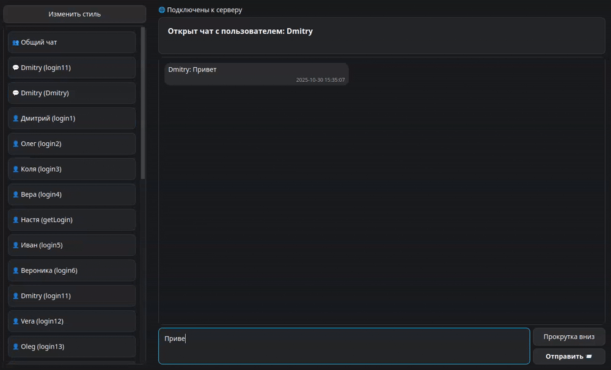

# Итоговый проект по разработке кроссплатформенного приложения чата на C++ с использованием MySQL и Qt

**Студент** - Зайкин Дмитрий

**Группа** - CPLUS-68


---

# Описание проекта
Система реализует трёхуровневую клиент‑серверную архитектуру с разделением на:
- серверную часть (Linux‑only);
- клиентское приложение (Linux/Windows);
- административную панель (Linux/Windows).

Взаимодействие между компонентами осуществляется по протоколу TCP/IP с сериализацией данных в формате JSON. Серверная часть использует СУБД MySQL для хранения пользовательских данных и истории сообщений, а клиентские приложения построены на фреймворке Qt, что обеспечивает кроссплатформенность интерфейса. Логика системы реализована на C++.
**Кодировка проекта**: UTF-8.



---


# Предварительная настройка, сборка и компиляция проекта

## Установка и настройка БД MySQL на серверной части (ОС: Linux)

### Выполнить установку БД MySQL на сервере:
```bash
sudo apt-get update
sudo apt-get install mysql-server
```
### Настройка БД:
Открыть MySQL в терминале:
```bash
sudo mysql
```

Добавление БД:
```sql
CREATE DATABASE IF NOT EXISTS chat
CHARACTER SET utf8mb4
COLLATE utf8mb4_unicode_ci;
```

Cоздать **пользователя БД** для входа `ALL PRIVILEGES`:
```sql
CREATE USER 'chatchat_user'@'localhost' IDENTIFIED BY '12345678';
GRANT ALL PRIVILEGES ON *.* TO 'chat_user'@'localhost';
FLUSH PRIVILEGES;

CREATE USER 'chat_user'@'127.0.0.1' IDENTIFIED BY '12345678';
GRANT ALL PRIVILEGES ON *.* TO 'chat_user'@'127.0.0.1';
FLUSH PRIVILEGES;
```

Выход:
```sql
\q
```

Перезапуск БД:
```bash
sudo systemctl restart mysql
```
Выполнить проверку доступа к MySQL локально на сервере:
```bash
mysql -u chat_user -p -h 127.0.0.1
```

### ❗ **Данные созданного пользователя и название БД должны совпадать со значениями полей класса** `DataBaseMySQL` в файле `BD_MySQL.h`:
- `SQL_USER` - пользователь;
- `SQL_PASS` - пароль;
- `SQL_BD` - база данных.

## Установка дополнительных библиотек

### Выполнить установку библиотеки JSON `json.hpp`
**Для ОС: Linux Ubuntu/Debian:**
```bash
sudo apt-get update
sudo apt-get install nlohmann-json3-dev
```

**Для ОС: Windows MinGW:**

Установка через vcpkg
```bash
# Установка через vcpkg
vcpkg install nlohmann-json:x64-mingw-dynamic
```


❗**Важно**: унификация версий JSON для сетевого взаимодействия:

Клиентская и серверная части взаимодействуют по сети (TCP) и используют JSON для сериализации данных, на всех компьютерах должна использоваться одинаковая минимальная версия библиотеки `nlohmann/json`.

В `CMakeLists.txt` заменить номер версии на минимальную:

Как проверить версию на Linux:
```bash
dpkg -s nlohmann-json3-dev | grep Version
Version: 3.7.3-1
```
В `CMakeLists.txt` указать эту версию:
```bash
find_package(nlohmann_json 3.7.3 REQUIRED)
```

### Выполнить установку библиотеки `mysql.h`
Для ОС: Linux Ubuntu/Debian:
```bash
sudo apt update
sudo apt install libmysqlclient-dev
sudo apt-get install pkg-config
```
Предполагаемые пути установки файлов:
- Заголовочные файлы: `/usr/include/mysql/` (`mysql.h`)
- Библиотека: `libmysqlclient.so` `/usr/lib/x86_64-linux-gnu/`

Проверка наличия файлов (`mysql.h`, `libmysqlclient.so`):
```bash
ls /usr/include/mysql/ | grep "mysql.h"
ls /usr/lib/x86_64-linux-gnu | grep "libmysqlclient.so"
```

### Выполнить установку `QT`

#### `QT` Linux (Ubuntu/Debian)
```bash
sudo apt update
sudo apt install qt6-base-dev qt6-tools-dev qt6-multimedia-dev cmake
```
#### `QT` Windows MinGW

**Способ 1: Установка через официальный установщик** [QT](https://www.qt.io/download-qt-installer)
- Скачать и установить Qt
- При установке выбрать Qt 6.x.x MinGW 64-bit
- После установки убедитесь, что путь к qmake.exe добавлен в PATH

**Способ 2: Установка QT для MinGW**
Запустите терминал MSYS2 MinGW64:
```bash
pacman -Syu
pacman -S mingw-w64-x86_64-qt6-base mingw-w64-x86_64-qt6-tools mingw-w64-x86_64-qt6-multimedia
```


## Настройка IP адресса

Взаимодействие программ осуществляется по сети (TCP). IP адресс сервера задается в обьекте `network` класса `NetworkClient` файл `main.cpp` клиенской части.

# Сборка и компиляция проекта CMake

## Сборка Linux (сервер + клиент + админ)

**Корневой CMakeLists.txt подключает подпроекты:**
- Сервер: chat_server (Linux-only)
- Клиент: Chat_client (Qt GUI)
- Админ-панель: Admin_client (Qt GUI)
- Общая статическая библиотека: common

Полная сборка (Linux): сервер + клиент + админ:
```bash
mkdir buildcd
cd build
cmake -DCMAKE_BUILD_TYPE=Release ..
cmake --build . --parallel
```

## Сборка только серверной части:
```bash
mkdir build
cd build
cmake -DCMAKE_BUILD_TYPE=Release ..
cmake --build . --target chat_server --parallel

```

## Сборка только пользовательского клиента:
```bash
mkdir build
cd build
cmake -DCMAKE_BUILD_TYPE=Release ..
cmake --build . --target Chat_client --parallel
```

## Сборка только админ-клиента:
```bash
mkdir build
cd build
cmake -DCMAKE_BUILD_TYPE=Release ..
cmake --build . --target Admin_client --parallel
```

## Очистка:
Linux:
```bash
rm -rf build
```
Windows:
```bash
rmdir /s /q build
```


## Запуск:
```bash
# Сервер
./build/server/chat_server

# Клиент
./build/client/chat_client

# Клиент
./build/admin/Admin_client
```